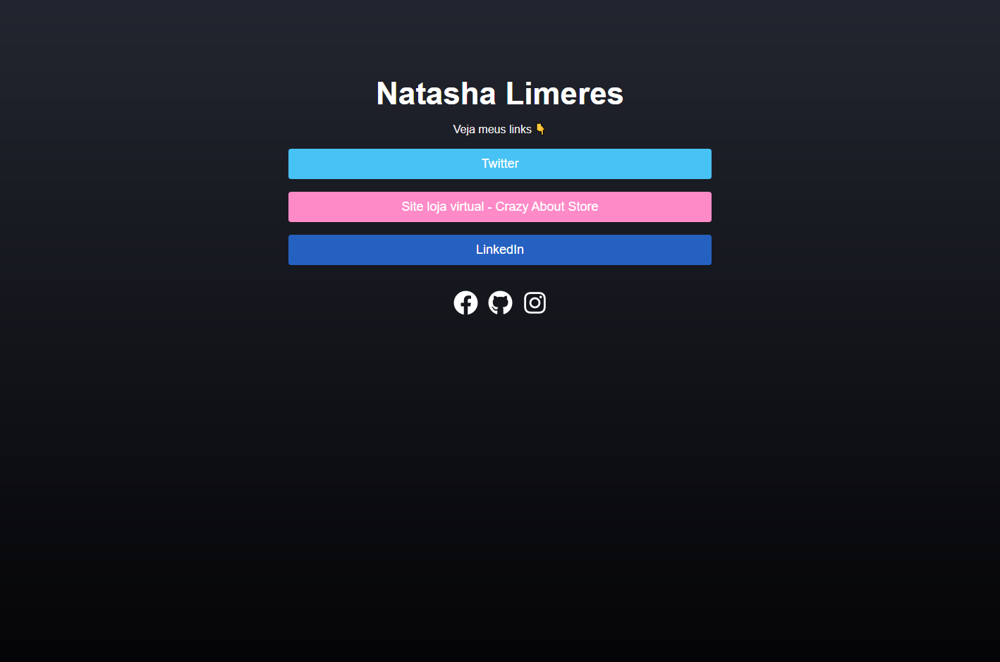
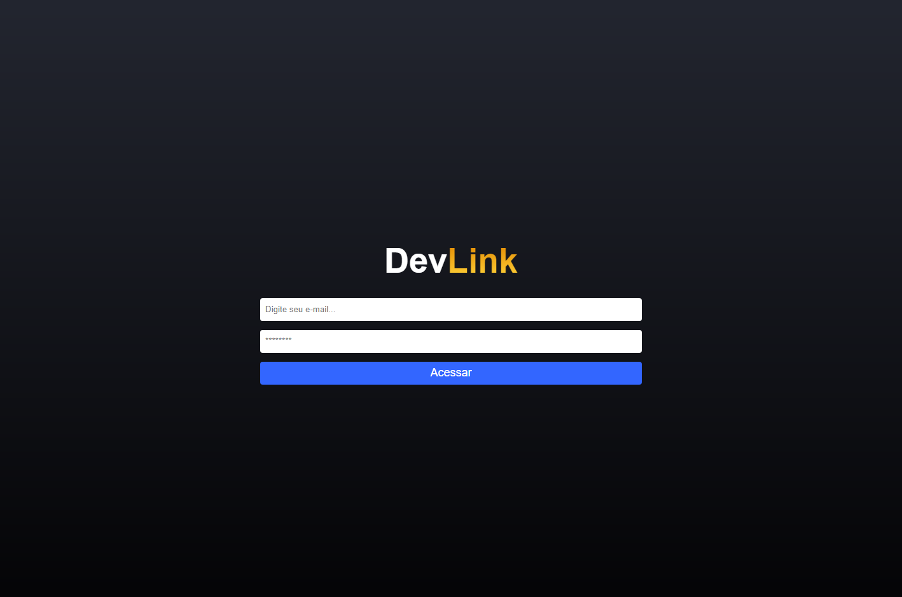
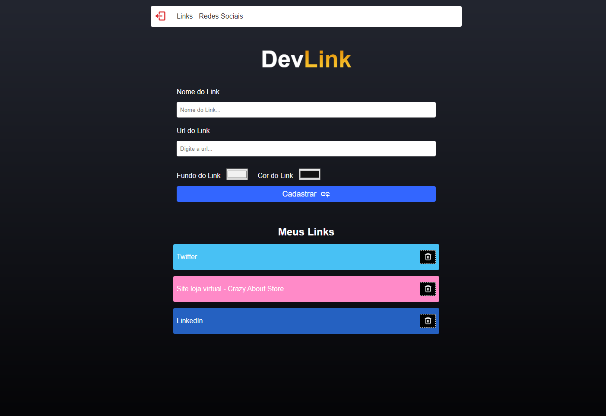
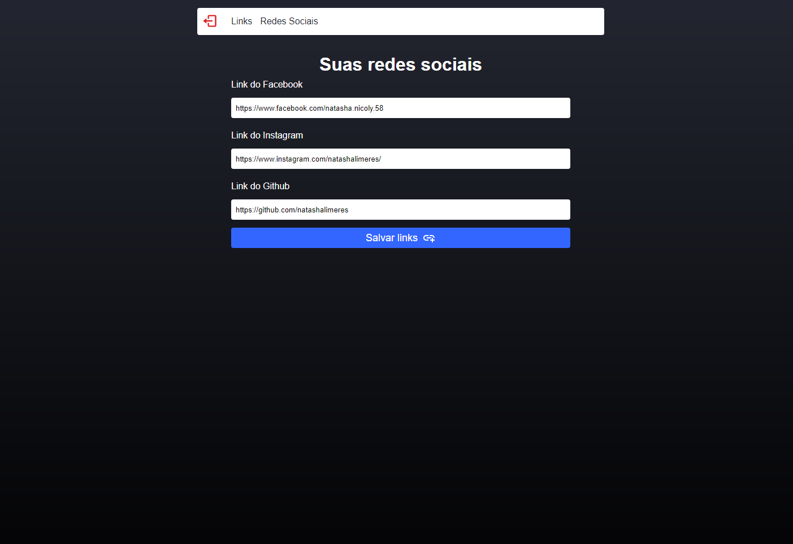

<h1>DevLinks</h1>
The project was made on Sujeito programador's React Workshop. We created a website to manage and share links.

🛠️ Principais conceitos abordados (Key concepts covered):

- Javascript
- React
- React Router
- Hooks
- Firebase (Firestore e Autenticação)

💻 After cloning the repository, it's necessary to run npm install on the project directory. Then, just run npm run start to serve locally.

